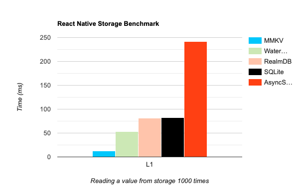
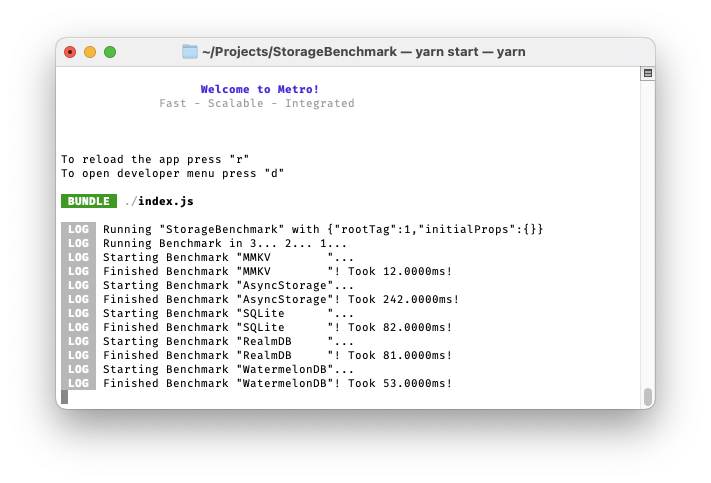

# Storage Benchmarks

This is a benchmark app to compare popular storage solutions for React Native.

It's running React Native 0.68, with Hermes enabled.

The Benchmark consists of calling a _get_ operation (retrieve one value from the database) a thousand times.

Here are the results, ranked from fastest to slowest:

1. [react-native-mmkv](https://github.com/mrousavy/react-native-mmkv): **12ms** 👑
2. [WatermelonDB](https://github.com/Nozbe/WatermelonDB): **53ms**
3. [RealmDB](https://github.com/realm/realm-js): **81ms**
4. [react-native-quick-sqlite](https://github.com/ospfranco/react-native-quick-sqlite): **82ms**
5. [AsyncStorage](https://github.com/react-native-async-storage/async-storage): **242ms**

MMKV is **20x** faster than AsyncStorage (slowest), and **4x** faster than WatermelonDB (second fastest)!

  

Output in the console:

  

> Tested on an iPhone 11 Pro, Hermes, Debug

## Run it

1. Clone the repo
2. Run `yarn`
3. Run `yarn pods`
4. Run `yarn ios --device "YOURPHONENAME"`

You can also omit the `--device "YOURPHONENAME"` flag, but running on a Simulator always gives different results than on an actual device.

### JS Engine

The benchmark project currently uses Hermes. To benchmark using JSC instead, set `enable_hermes` to `false` in the [`Podfile`](./ios/Podfile).

### Hardware

The above results were tested on an iPhone 11 Pro. Results may differ on different iPhones or Android Phones.

### Debug

The above results were tested in a debug build. Release mode builds come with many optimizations and are therefore faster than debug.

### Operations

The above results were tested using _get_ operations for a single string key (value: `'hello'`). Results may differ when using other operations, such as _set_, _delete_, _update_, and more.
